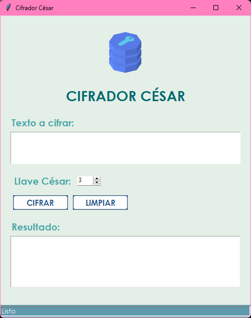
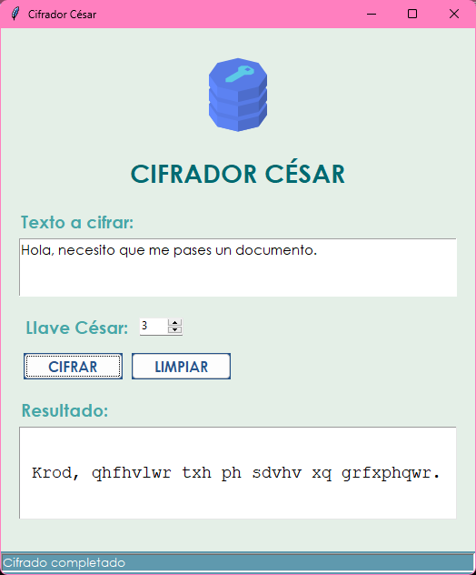

# 🔐 Cifrador César
Este proyecto es una sencilla aplicación que implementa el cifrado César, un método clásico de cifrado por sustitución que desplaza las letras del mensaje original un número fijo de posiciones en el alfabeto.

## 📌 ¿Qué es el Cifrado César?
El cifrado César es una técnica de criptografía simétrica en la que cada letra del texto plano se reemplaza por otra que se encuentra un número fijo de posiciones más adelante en el alfabeto. Por ejemplo, con un desplazamiento de 3, la letra A se convierte en D, B en E, y así sucesivamente.

## 📌 Características
* Cifrado de texto mediante desplazamiento.
* Permite elegir la cantidad de desplazamiento.
* Compatible con letras mayúsculas y minúsculas.
* Interfaz por consola.
* Validación de entrada básica.
* Conexión con una base de datos.

## ⚙️ Implementación
### Pantalla inicial

### Cifrado de un texto

# ✍🏼 Colaboradores 
El proyecto fue realizado para la materia de Habilidades Directivas en la Facultad de Estudios Superiores Aragón durante el semestre 2025-II.

💻 Cuevas Tello Eduardo **([cuevasedu04](https://github.com/cuevasedu04))**  
💻 García EstradaAriadna Denisse **([ariadna-ge](https://github.com/ariadna-ge))**  
💻 Pérez Abad Alan Efrain  
💻 Ramos Badillo Gustavo Yael **([Yae1Ram0s](https://github.com/Yae1Ram0s))**  
